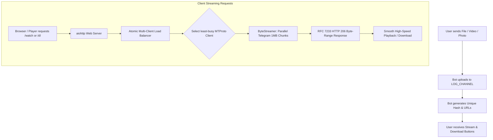

<div align="center">


# ⚡ File 2 Link ™

**High-Performance Telegram Cloud Streamer & Instant Direct Download Engine**

[](https://www.python.org)
[](https://t.me/wudixh15)
[](https://aiohttp.readthedocs.io)
[](https://www.mongodb.com)
[](https://www.docker.com)

<p align="center">
  <b>Send any Telegram file → Get instant high-speed streaming links & direct downloads with multi-client load balancing.</b>
</p>

[Deploy to Koyeb](https://app.koyeb.com/deploy?type=git&repository=github.com/GouthamSER/FileToLink&branch=main&builder=dockerfile) • [Deploy to Heroku](https://heroku.com/deploy?template=https://github.com/GouthamSER/FileToLink) • [Deploy to Render](https://render.com/deploy?repo=https://github.com/GouthamSER/FileToLink) • [Telegram Updates](https://t.me/wudixh15)

</div>

---

## 🌟 Highlights & Key Features

### 🎬 Universal Streaming Web Player (`/watch/{id}`)
- **Universal Format Engine**: Native support for all major containers: `.mkv`, `.mp4`, `.webm`, `.avi`, `.mov`, `.flv`, `.m4v`, `.ts`, and `.3gp`.
- **Dedicated Music & Audio Mode**: Audio files (`.mp3`, `.flac`, `.wav`, `.ogg`, `.m4a`, `.aac`) automatically switch to an ambient vinyl disc visualizer player.
- **Cyberpunk Glassmorphism UI**: Ultra-clean obsidian theme (`#07070b`) with ambient neon glows, frosted glass cards, and Google Fonts typography (`Plus Jakarta Sans` & `JetBrains Mono`).
- **One-Click External App Launchers**: Deep intent launchers for:
  - 🚗 **VLC Media Player** (Universal Android Intent & iOS `vlc://` scheme)
  - ⚡ **MX Player** (Android Intent)
  - 🍎 **nPlayer** (iOS & macOS deep link)
  - 🎞️ **KMPlayer** & 🖥️ **PotPlayer** (Windows PC)
  - 🌐 **Raw Network Stream URL Copy** for Kodi, Infuse, and IINA
- **Smart Codec Fallback Guard**: Automatically alerts users if their browser lacks native decoders for complex MKV/HEVC/AC3 codecs and offers a one-tap jump into VLC/MX Player.
- **Keyboard Shortcuts**: Desktop control with `Space` (Play/Pause), `←/→` (Seek ±10s), `↑/↓` (Volume), `F` (Fullscreen), and `M` (Mute).

### 🚀 Direct Download Hub (`/{id}`)
- **Gigabit Chunked Streaming**: Full HTTP/1.1 Range header support (`206 Partial Content`) for multi-threaded download accelerators (IDM, 1DM, ADM, FDM, aria2).
- **Format-Aware Visual Badging**: Custom format icons and colored badges for video, audio, archives (`.zip`, `.rar`, `.7z`), software, and documents.
- **Native Web Share API**: One-click file sharing on mobile with clipboard copy fallback and custom toast feedback.
- **Dynamic Connection Animation**: Visual download handshake indicator.

### 🛡️ Core Reliability & Bot Architecture
- **Multi-Client Load Balancing**: Round-robin and active-workload client balancing across multiple bot tokens (`MULTI_TOKEN1..N`) for virtually unlimited concurrent throughput.
- **Atomic Reservation Lock**: Zero-gap client selection prevents race conditions when download accelerators open 16–32 connections in parallel.
- **Parallel Chunk Prefetching**: Per-stream concurrent chunk fetching (`CONCURRENT_FETCHES`) minimizes video buffering delays.
- **Resilient Retry Mechanism**: Automatic backoff retries for transient Telegram RPC errors (`-503 Timeout`, `FloodWait`, socket drops).
- **All Media Types Supported**: Documents, videos, audios, photos, voice notes, video notes, and stickers.
- **Permanent Link Revocation**: One-tap 🗑️ **Delete / Revoke** button with two-step confirmation window allows uploaders and admins to permanently remove files from storage.
- **Zero-Crash MongoDB Integration**: Gracefully runs even if `DATABASE_URI` is unset or MongoDB is temporarily unreachable.
- **Clean SIGTERM Shutdown**: Graceful cleanup handles Heroku R12 / Koyeb termination cleanly without killing active connections or corrupting downloads.

---

## 🏗️ Architecture Flow



---

## 📦 Deployment & Setup

### 1. One-Click Cloud Deploy

| Platform | Deployment Button |
|---|---|
| **Koyeb** *(Recommended)* | [](https://app.koyeb.com/deploy?type=git&repository=github.com/GouthamSER/FileToLink&branch=main&builder=dockerfile) |
| **Heroku** | [](https://heroku.com/deploy?template=https://github.com/GouthamSER/FileToLink) |
| **Render** | [](https://render.com/deploy?repo=https://github.com/GouthamSER/FileToLink) |

---

### 2. Manual & VPS Setup

```bash
# Clone the repository
git clone https://github.com/GouthamSER/FileToLink.git
cd FileToLink

# Install dependencies
pip install -r requirements.txt

# Configure your environment variables (.env)
cp app.json .env # or configure manually

# Start the bot
python bot.py
```

### 3. Docker Deployment

```bash
# Build the optimized container
docker build -t file2link .

# Run with environment file
docker run -d -p 8080:8080 --env-file .env --name file2link_app file2link
```

---

## ⚙️ Configuration Variables

| Variable | Required | Description |
|---|:---:|---|
| `API_ID` | **Yes** | Telegram API ID from [my.telegram.org](https://my.telegram.org). |
| `API_HASH` | **Yes** | Telegram API Hash from [my.telegram.org](https://my.telegram.org). |
| `BOT_TOKEN` | **Yes** | Main Telegram Bot Token from [@BotFather](https://t.me/BotFather). |
| `LOG_CHANNEL` | **Yes** | Telegram Channel ID (e.g. `-1001234567890`) used as file storage. Bot must be Admin. |
| `URL` | **Yes** | Public root URL (e.g. `https://myapp.koyeb.app/`). Trailing slashes and health paths auto-sanitized. |
| `DATABASE_URI` | Optional | MongoDB connection string (`mongodb+srv://...`). Bot runs with DB disabled if omitted. |
| `DATABASE_NAME` | Optional | MongoDB database name (default: `FileToLink`). |
| `ADMINS` | Optional | Space-separated list of Admin IDs or usernames (e.g. `12345678 @username`). |
| `FSUB_CHANNEL` | Optional | Force-subscribe channel ID (e.g. `-1009876543210`). `0` = disabled. |
| `PORT` | Optional | Web server port (default: `8080`). |
| `MULTI_TOKEN1..N` | Optional | Additional Bot Tokens for multi-client load balancing. Add each bot as Admin in `LOG_CHANNEL`. |
| `SHORTLINK` | Optional | Enable Shortzy-based URL shorteners (`True` / `False`). |
| `SHORTLINK_URL` | Optional | Shortener base site URL (e.g. `api.shareus.io`, `gplinks.com`). |
| `SHORTLINK_API` | Optional | Shortener API key. |
| `ISGD` | Optional | Enable free `is.gd` shortener (`True` / `False`). |
| `AUTO_RESTART` | Optional | Periodic graceful restart trigger (default: `True`, 6-hour interval). |

---

## 🎮 Telegram Bot Commands

| Command | Permission | Description |
|---|:---:|---|
| `/start` | Everyone | Start the bot, receive welcome guide & verify channel subscription. |
| `/how` | Everyone | Comprehensive user guide on how to stream, download, and revoke links. |
| `/stats` | Admins | Real-time system diagnostics (RAM, CPU, Uptime, Network I/O, User count). |
| `/broadcast` | Admins | Broadcast a replied message to all registered bot users in MongoDB. |
| `/restart` | Admins | Trigger a graceful SIGTERM restart with in-flight stream and client safety. |

---

## 📈 Multi-Client Scaling & Performance Tips

> [!TIP]
> **Scaling Formula**: Each additional `MULTI_TOKEN` handles roughly 3–5 concurrent high-bitrate video streams before Telegram triggers rate limiting.
> `Tokens Needed ≈ Target Peak Concurrent Streams / 4`

- **Memory Consumption**: Each MTProto client consumes roughly 25–35 MB RAM. On a free 512 MB dyno/container, 5–8 clients run comfortably.
- **Maximum Download Speed**: For desktop downloads, recommend **IDM** with 16 connections. For mobile downloads, recommend **1DM** or **ADM**.
- **Live Health Status**: Visit `GET /` or `GET /?json=true` on your deployment URL anytime to view live uptime, active workload counts, and client distribution.

---

## 📁 Repository Structure

```
FileToLink/
├── bot.py                     # Main application entrypoint & graceful lifecycle manager
├── info.py                    # Environment parser, admin validator & URL sanitizer
├── Script.py                  # Localized Telegram text formatting & banners
├── utils.py                   # URL shortener service wrappers & temporary state
├── database/
│   └── users_chats_db.py      # Async MongoDB persistence layer with fail-safe guards
├── lib/
│   ├── bot/
│   │   ├── __init__.py        # Primary Pyrogram client definition
│   │   └── clients.py         # Multi-client pool initialization & graceful stopper
│   ├── server/
│   │   └── exceptions.py      # Custom exceptions (InvalidHash, FIleNotFound)
│   ├── template/
│   │   ├── req.html           # Reimagined Cyberpunk Glassmorphic Video/Audio Player
│   │   └── dl.html            # High-Speed Download Portal & acceleration guide
│   └── util/
│       ├── custom_dl.py       # Custom ByteStreamer for Telegram chunked byte-range fetches
│       ├── file_properties.py # Media type detector & universal filename synthesizer
│       ├── human_readable.py  # Safe byte formatter (handles 0 B to PiB without crashes)
│       ├── keepalive.py       # Pinger to prevent dyno idle sleep
│       └── render_template.py # Format-aware Jinja2 compiler & cached renderer
└── plugins/
    ├── route.py               # aiohttp streaming engine, RFC 206 byte-range handler
    ├── start.py               # Media receiver, HTML escaping, link generator & revoker
    ├── broadcast.py           # Admin broadcasting with FloodWait & error handlers
    ├── etc.py                 # Live hardware & process stats with refresh buttons
    └── selfping.py            # Self-ping keepalive loop
```

---

## 🤝 Support & Community

- **Developer**: [Goutham](https://github.com/GouthamSER)
- **Updates Channel**: [@wudixh15](https://t.me/wudixh15)
- **License**: [GNU General Public License v3.0](LICENSE)

<div align="center">
  <sub>Made with ❤️ for high-performance Telegram streaming.</sub>
</div>
